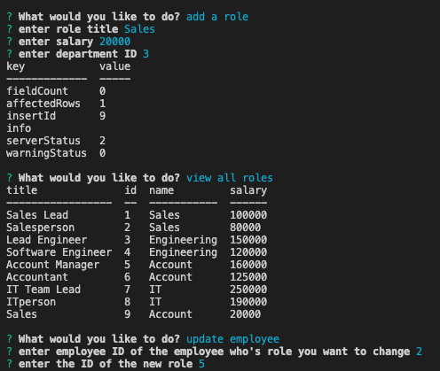
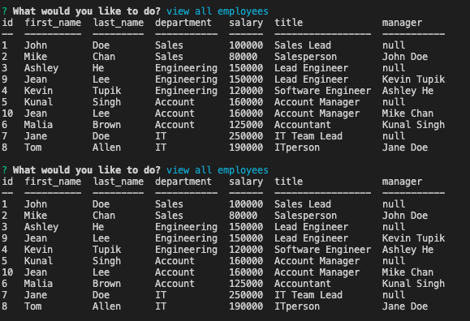

# employee_tracker
## Table of Contents
- Description
- Installation
- Usage
- Contribution
- License & Copyright
- Questions

## Description:
This is a command_line application called Employee Tracker, it allows a company to easily view and interact with information stored in databases. This application will use an Node.js, Inquirer, and MySQL to manage the departments, roles, and employees database in a company.

## Installation:
Node.js, Inquirer, and MySQL

## Usage(How to use):
WHEN you start the application, THEN you are presented with the following options: view all departments, view all roles, view all employees, add a department, add a role, add an employee, and update an employee role;
WHEN you choose to view all departments, THEN you are presented with a formatted table showing department names and department ids;
WHEN you choose to view all roles, THEN you are presented with the job title, role id, the department that role belongs to, and the salary for that role;
WHEN you choose to view all employees, THEN you are presented with a formatted table showing employee data, including employee ids, first names, last names, job titles, departments, salaries, and managers that the employees report to;
WHEN you choose to add a department, THEN you are prompted to enter the name of the department and that department is added to the database;
WHEN you choose to add a role, THEN you are prompted to enter the name, salary, and department for the role and that role is added to the database;
WHEN you choose to add an employee, THEN you are prompted to enter the employee’s first name, last name, role, and manager, and that employee is added to the database;
WHEN you choose to update an employee role, THEN you are prompted to select an employee to update and their new role and this information is updated in the database;
WHEN you choose to quit the application, THEN you will exit the application;

## Contribution:
Use Node.js, Inquirer, and MySQL

## License & Copyright:
Copyright © 2022 <Jing Li>. 
Licensed under the [MIT License](LICENSE).

## Questions:

- GitHub: https://github.com/Jean424?tab=repositories
- Email: jeanlee.jingli@icloud.com

## Link
- Link to the walkthrough vedio:  https://watch.screencastify.com/v/FLMqTy6TV75Q7V4dZIdJ
- Screen_Shot of Note-Taker:

